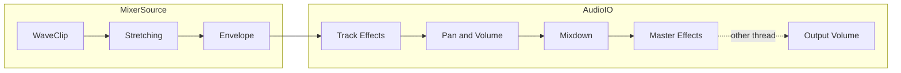
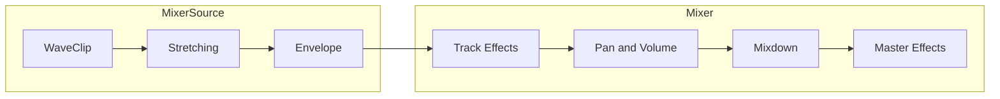

### Realtime playback

```mermaid
flowchart LR
    subgraph "MixerSource"
      WaveClip --> Stretching --> Envelope
    end
    subgraph "AudioIO"
      EffectStack["Track Effects"]
      PanAndVolume["Pan and Volume"]
      Mixdown
      MasterEffects["Master Effects"]
      OutputVolume["Output Volume"]
    end
    Envelope --> EffectStack --> PanAndVolume --> Mixdown --> MasterEffects -. other thread .-> OutputVolume
```

### Export

```mermaid
flowchart LR
    subgraph "MixerSource"
      WaveClip --> Stretching --> Envelope
    end
    subgraph "Mixer"
      EffectStack["Track Effects"]
      PanAndVolume["Pan and Volume"]
      Mixdown
      MasterEffects["Master Effects"]
    end
    Envelope --> EffectStack --> PanAndVolume --> Mixdown --> MasterEffects
```
