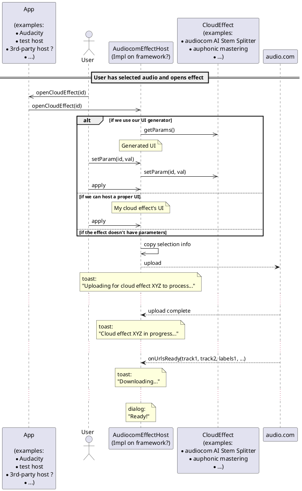

```plantuml
@startuml
participant App as "App\n\n(examples:\n* Audacity\n* test host\n* 3rd-party host ?\n* ...)"
actor User
participant Host as "AudiocomEffectHost\n(Impl on framework?)"
participant CloudEffect as "CloudEffect\n(examples:\n* audiocom AI Stem Splitter\n* auphonic mastering\n* ...)"
participant "audio.com" as audiocom

== User has selected audio and opens effect ==
User ->> App: openCloudEffect(id)
App ->> Host: openCloudEffect(id)
alt if we use our UI generator
Host ->> CloudEffect: getParams()
note over Host: Generated UI
User ->> Host: setParam(id, val)
Host ->> CloudEffect: setParam(id, val)
User ->> Host: apply
else if we can host a proper UI
note over Host: My cloud effect's UI
User ->> Host: apply
else if the effect doesn't have parameters
end
Host ->> Host: copy selection info
Host --> audiocom: upload
note over Host: toast:\n"Uploading for cloud effect XYZ to process..."
...
audiocom --> Host: upload complete
note over Host: toast:\n"Cloud effect XYZ in progress..."
...
audiocom --> Host: onUrlsReady(track1, track2, labels1, ...)
note over Host: toast:\n"Downloading..."
...
note over Host: dialog:\n"Ready!"

@enduml
```
