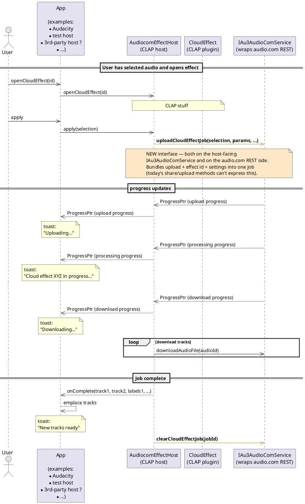

```plantuml
@startuml
actor User
participant App as "App\n\n(examples:\n* Audacity\n* test host\n* 3rd-party host ?\n* ...)"
participant Host as "AudiocomEffectHost\n(CLAP host)"
participant CloudEffect as "CloudEffect\n(CLAP plugin)"
participant "IAu3AudioComService\n(wraps audio.com REST)" as audiocom

== User has selected audio and opens effect ==
User ->> App: openCloudEffect(id)
App ->> Host: openCloudEffect(id)
note over Host, CloudEffect: CLAP stuff
User ->> App: apply
App ->> Host: apply(selection)
Host -[#DarkOrange]>> audiocom: **uploadCloudEffectJob(selection, params, ...)**
note over Host, audiocom #FEE8C8: NEW interface — both on the host-facing\nIAu3AudioComService and on the audio.com REST side.\nBundles upload + effect id + settings into one job\n(today's share/upload methods can't express this).
== progress updates ==
audiocom -->> Host: ProgressPtr (upload progress)
Host -->> App: ProgressPtr (upload progress)
note over App: toast:\n"Uploading..."
audiocom -->> Host: ProgressPtr (processing progress)
Host -->> App: ProgressPtr (processing progress)
note over App: toast:\n"Cloud effect XYZ in progress..."
...
audiocom -->> Host: ProgressPtr (download progress)
Host -->> App: ProgressPtr (download progress)
note over App: toast:\n"Downloading..."
loop download tracks
Host ->> audiocom: downloadAudioFile(audioId)
end
...

== Job complete ==
Host -->> App: onComplete(track1, track2, labels1, ...)
App -->> App: emplace tracks
note over App: toast:\n"New tracks ready"
Host -[#DarkOrange]>> audiocom: **clearCloudEffectJob(jobId)**
@enduml

@startuml
actor User
participant Audacity
participant Task as "CloudEffectTask\n(Audacity class)"
participant ExtUi as "MyCloudEffectUi\n(3rd-party)"
participant Script as "MyCloudEffectScript\n(async main)"
participant Audiocom
participant 3rd as "3rd party service"

User -> ExtUi:open
activate ExtUi
note over ExtUi:UI
User -> ExtUi: apply
ExtUi -->> Task:create(params)
activate Task
deactivate ExtUi
Task-->>Audacity:toast("Cloud effect initiated...")
Task -->> Audiocom:requestSelection(projectId, selection)
note over Audiocom:Creates audio from selection\nusing audacit exec:\n`audacity project -export sel.json`
Audiocom -->> Task:urls
Task ->> Script:async main()
Script -->> Task: Promise<Output> (pending)
note over Script: await someCommand(...)
Script ->> 3rd: someCommand(params, urls)
note over 3rd:processing...
...
...
note over 3rd:... done.
3rd -->> Script:newUrls
note over Script: main resolves
Script -->> Task: Output (newUrls)
Task -->> Audiocom:integrate(projectId, selection, newUrls)
deactivate Task
note over Audiocom:`audacity project -integrate selection newUrls`
Audiocom -->> Audacity:sync
@enduml

@startuml
class AudioFile {
  string url
  real startTime
  ...
}

note bottom of AudioFile
  `url` -> authentication ?
end note

class Selection {
 var audioFiles: []
 ...
}

class Output {
  var audioFiles: []
  ...
}

class CloudEffectScript {
  async main(Selection sel, params): Output
}

class MyCloudEffectScript {
  main: async function (sel, params) { /* call service, await, return Output */ }
}

Selection *-- AudioFile
Output *-- AudioFile

CloudEffectScript <|-- MyCloudEffectScript
@enduml
```
