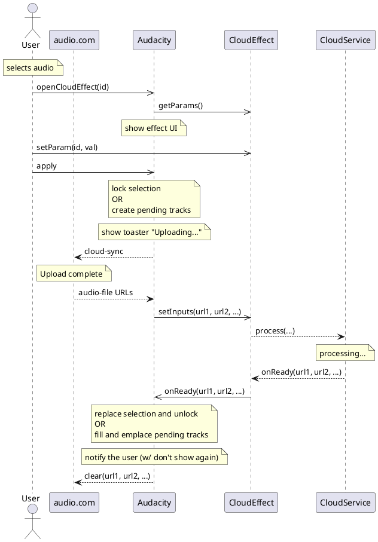

```plantuml
@startuml
actor User
participant "audio.com" as audiocom
participant Audacity
participant CloudEffect
participant CloudService

note over User: selects audio
User ->> Audacity: openCloudEffect(id)
Audacity ->> CloudEffect: getParams()
note over Audacity: show effect UI
User ->> CloudEffect: setParam(id, val)
User ->> Audacity: apply
note over Audacity: lock selection\nOR\ncreate pending tracks
note over Audacity: show toaster "Uploading..."
Audacity --> audiocom: cloud-sync
note over audiocom: Upload complete
audiocom --> Audacity: audio-file URLs
Audacity ->> CloudEffect: setInputs(url1, url2, ...)
CloudEffect --> CloudService: process(...)
note over CloudService: processing...
CloudService --> CloudEffect: onReady(url1, url2, ...)
CloudEffect ->> Audacity: onReady(url1, url2, ...)
note over Audacity: replace selection and unlock\nOR\nfill and emplace pending tracks
note over Audacity: notify the user (w/ don't show again)
Audacity --> audiocom: clear(url1, url2, ...)
@enduml
```
