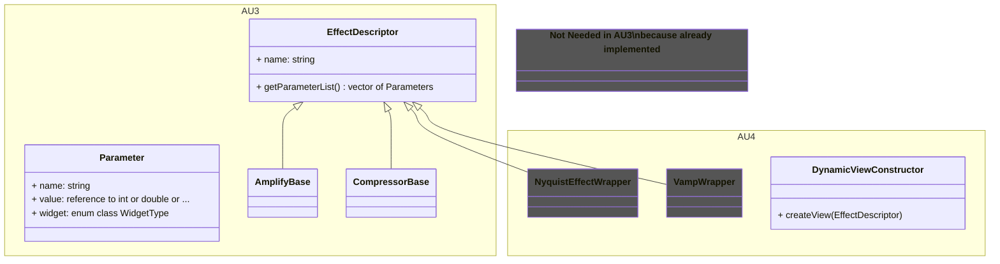

<!-- a simple table -->

### Widgets needed for Nyquist and Vamp full support

| Param type                   | Nyquist | Vamp | Comment                                                             |
| ---------------------------- | ------- | ---- | ------------------------------------------------------------------- |
| float text input + slider    | Y       | Y    |                                                                     |
| int text input + slider      | Y       | N    |                                                                     |
| float text input (wo slider) | Y       | N    |                                                                     |
| int text input (wo slider)   | Y       | N    |                                                                     |
| string text input            | Y       | N    | e.g. to enter label names in "Regular Interval Labels" Nyquist tool |
| dropdown                     | Y       | Y    |                                                                     |
| numeric text                 | Y       | N    | E.g. like AU3's selection toolbar                                   |
| choose file                  | Y       | N    | E.g. in "Sample Data Export" Nyquist tool                           |
| checkbox                     | N       | Y    |                                                                     |

### Proposal for dynamic view construction of Nyquist, Vamp and built-in effects

