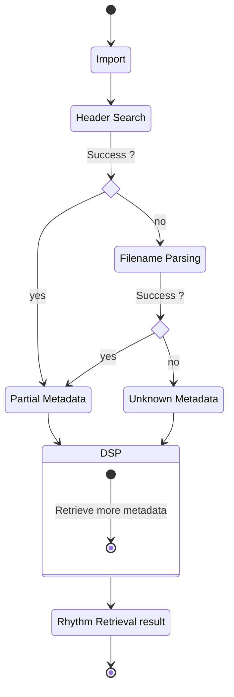

## Rhythm Metadata

The rhythm retrieval step yields an optional metadata structure. If empty, then the clip is considered arythmic and no further action is taken. Else, it contains the following information:

```jsonc
{
   "isLoop": "yes/no",
   "tempi": [
      { "0.0": 120.0 }, // 1st is mandatory
      { "30.0": 180.0 } // rest is optional
      // etc
   ],
   "onsets": /*may be empty*/ [0.0, 0.51 /* and so on */],
   "timeSignatures": /*may be empty*/ [
      { "1" /*bar*/: { "num": 4, "den": 4 } },
      { "9": { "num": 3, "den": 4 } }
      // etc
   ]
}
```

Collecting all this metadata may be too ambitious, but it could be done little by little and can even stay incomplete.

### isLoop

We cannot trust that a loop with metadata e.g. 120bpm has a duration matching exactly a round number of bars. Hence knowing whether it is a loop can allow us to match it _exactly_ to the musical grid. Side effect: someone dropping a loop with 120bpm metadata on project at 120bpm will see either the project tempo or the clip stretch adapt.

### Tempi

Has at least one entry at time `0.0`. If it has exactly one entry, then the clip is considered constant-tempo and the tempo-adaptation step (change project tempo or clip speed) can be taken. Else, we cannot do anything until we have tempo automation.

### Onsets

May be empty. Finding onsets is easy, and can be used later as warping handles (design work needed). If time signatures are detected, and in conjunction with tempi, each could be assigned to a bar number and quarter-note onset and we could consider automatic warping.

### Time Signatures

This information may be found in the ACID header or by DSP. Maps bar number to time signature. May be empty if couldn't be found. If not empty, first entry always begins at bar 1.

### Summary

| Fields          | Is mandatory | Found by                                                         |
| --------------- | ------------ | ---------------------------------------------------------------- |
| Rhythm Metadata | no           | parsing + DSP                                                    |
| isLoop          | yes          | parsing or DSP if parsing failed                                 |
| Tempi           | yes          | 1st entry: parsing or DSP if parsing failed ; other entries: DSP |
| Onsets          | no           | DSP                                                              |
| Time Signatures | no           | 1st entry: parsing or DSP if parsing failed ; other entries: DSP |

## Rhythm Retrieval



## Integration

Interactions with user are questions within double quotes.

```mermaid
stateDiagram-v2
DisambiguationButton: ÷2 or ×2 appears
ProjX: Project Meter X
ProjY: Project Meter Y
ProjZ: Project Meter Z
ClipY: Clip Meter Y
ClipZ: Clip Meter Z
Retrieval: Rhythm Retrieval
Metadata: Rhythm Metadata
TempoP: Provisional Tempo PT
RoundTempo: FT = ToRoundNumBars(PT)
DontRoundTempo: FT = PT
FinalTempo: Final tempo = FT
ChangeTempo: ChangeTempo = true
DontChangeTempo: ChangeTempo = false
state checkChangeTempo <<choice>>
state isLoop <<choice>>
state ansQ1 <<choice>>
state hasRhythm <<choice>>
state musicMode <<choice>>
state isAmbiguous <<choice>>
state disambiguationUsed <<choice>>
state isEmpty <<choice>>
state adaptProject <<choice>>
state Retrieval {
   [*] --> [*]: Retrieval Logic
}
[*] --> ProjX
ProjX --> Import
Import --> Retrieval
Retrieval --> hasRhythm: Successful ?
hasRhythm --> [*]: no
hasRhythm --> Metadata: yes
state hasConstantTempo <<choice>>
Metadata --> hasConstantTempo: Has constant tempo ?
hasConstantTempo --> [*]: no
hasConstantTempo --> musicMode: yes\nB&B view ?
TempoAdjustment: Snap tempo to round bar number if loop
state TempoAdjustment {
   [*] --> TempoP
   TempoP --> isLoop: "Is Loop ?"
   isLoop --> RoundTempo: yes
   isLoop --> DontRoundTempo: no
   RoundTempo --> FinalTempo
   DontRoundTempo --> FinalTempo
   FinalTempo --> [*]
}
musicMode --> TempoAdjustment: yes
musicMode --> ansQ1: no\n"Switch to B&B View ?"
ansQ1 --> [*]: no
ansQ1 --> TempoAdjustment: yes
TempoAdjustment --> ClipY
ClipY --> ProjectAdaptation
ProjectAdaptation: Determine whether project meter should adapt
state ProjectAdaptation {
   isEmpty : Project was empty ?
   [*] --> isEmpty
   isEmpty --> DontChangeTempo: no
   isEmpty --> adaptProject: yes\n"Change Project Tempo ?"
   adaptProject --> ChangeTempo: yes
   adaptProject --> DontChangeTempo: no
   DontChangeTempo --> [*]
   ChangeTempo --> ProjY
   ProjY --> [*]
}
ProjectAdaptation --> Disambiguation
Disambiguation: Allow user to correct ÷2 or ×2 mistake
state Disambiguation {
   [*] --> isAmbiguous : Was there another likely meter ?
   isAmbiguous --> [*] : no
   isAmbiguous --> DisambiguationButton : yes
   DisambiguationButton --> disambiguationUsed : Clicked ?
   disambiguationUsed --> [*] : no
   disambiguationUsed --> ClipZ : yes
   ClipZ --> checkChangeTempo : ChangeTempo is true ?
   checkChangeTempo --> [*] : no
   checkChangeTempo --> ProjZ : yes
   ProjZ --> [*]
}
Disambiguation --> [*]
```


