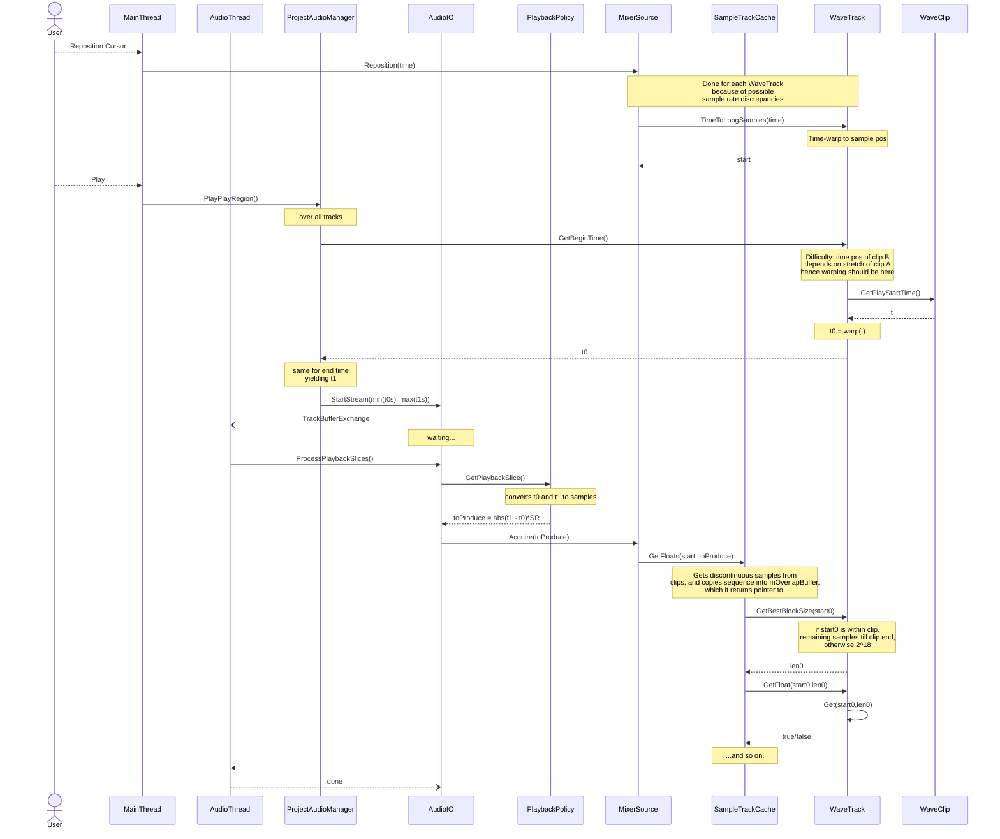

```mermaid
sequenceDiagram
    actor User
    participant MainThread
    participant AudioThread
    participant ProjectAudioManager
    participant AudioIO
    participant PlaybackPolicy
    participant MixerSource
    participant SampleTrackCache
    participant WaveTrack
    participant WaveClip

    User -->> MainThread:Reposition Cursor
    MainThread ->>MixerSource:Reposition(time)
    Note over MixerSource, WaveTrack: Done for each WaveTrack<br/>because of possible<br/>sample rate discrepancies
    MixerSource ->> WaveTrack:TimeToLongSamples(time)
    Note over WaveTrack:Time-warp to sample pos
    WaveTrack -->> MixerSource:start

    User -->> MainThread:Play
    MainThread->>ProjectAudioManager:PlayPlayRegion()
    Note over ProjectAudioManager:over all tracks
    ProjectAudioManager->>WaveTrack:GetBeginTime()
    Note over WaveTrack:Difficulty: time pos of clip B<br/>depends on stretch of clip A<br/>hence warping should be here
    WaveTrack->>WaveClip:GetPlayStartTime()
    WaveClip-->>WaveTrack:t
    Note over WaveTrack:t0 = warp(t)
    WaveTrack-->>ProjectAudioManager:t0
    Note over ProjectAudioManager:same for end time<br/>yielding t1
    ProjectAudioManager->>AudioIO:StartStream(min(t0s), max(t1s))
    AudioIO--)AudioThread:TrackBufferExchange
    Note over AudioIO:waiting...
    AudioThread->>AudioIO:ProcessPlaybackSlices()
    AudioIO->>PlaybackPolicy:GetPlaybackSlice()
    Note over PlaybackPolicy:converts t0 and t1 to samples
    PlaybackPolicy-->>AudioIO:toProduce = abs(t1 - t0)*SR
    AudioIO ->> MixerSource:Acquire(toProduce)
    MixerSource->>SampleTrackCache:GetFloats(start, toProduce)
    Note over SampleTrackCache:Gets discontinuous samples from<br/>clips,  and copies sequence into mOverlapBuffer,<br/>which it returns pointer to.
    SampleTrackCache ->> WaveTrack:GetBestBlockSize(start0)
    Note over WaveTrack:if start0 is within clip,<br/>remaining samples till clip end,<br/>otherwise 2^18
    WaveTrack -->> SampleTrackCache:len0
    SampleTrackCache->>WaveTrack:GetFloat(start0,len0)
    WaveTrack->>WaveTrack:Get(start0,len0)
    WaveTrack-->>SampleTrackCache:true/false
    Note over SampleTrackCache:...and so on.
    SampleTrackCache-->>AudioThread: 
    AudioThread--)AudioIO:done
```