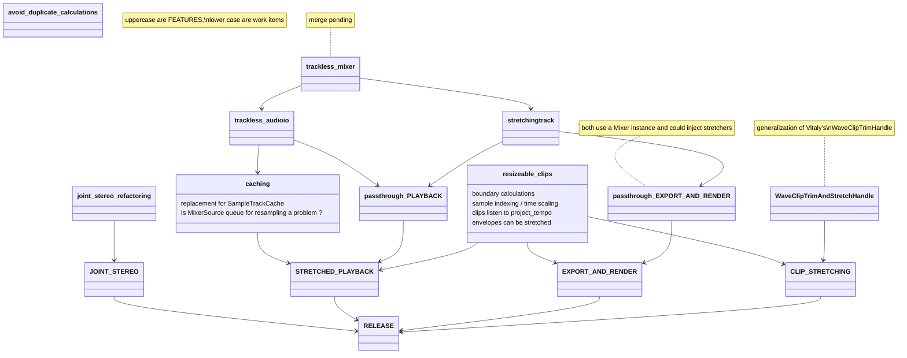

What to do in which order:
1. `stretchingtrack`: then `passthrough_EXPORT_AND_RENDER` can be tested
2. `resizeable_clips`: clips are resized IF SYNC_CLIPS_TO_PROJECT_TEMPO toggle is defined (must NOT be accessible to users at that stage)
3. `caching`: stretched playback doesn't suffer hick-ups anymore

