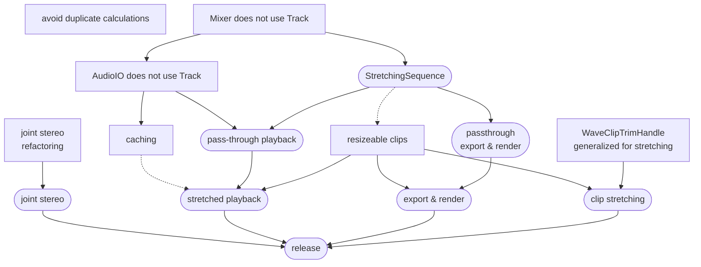

Rounded boxes are testable milestones, rectangles work items.

```mermaid
flowchart TD
   passthrough_playback([pass-through playback])
   passthrough_export_and_render([passthrough\nexport & render])
   joint_stereo([joint stereo])
   stretched_playback([stretched playback])
   export_and_render([export & render])
   clip_stretching([clip stretching])
   release([release])
   stretchingtrack([StretchingSequence])
   wavecliptrimandstretchhandle[WaveClipTrimHandle\ngeneralized for stretching]
   joint_stereo_refactoring[joint stereo\nrefactoring]

   %% BIG ONE: resizable_clips entails
   %% * boundary calculations
   %% * sample indexing / time scaling
   %% * clips listen to project_tempo
   %% * envelopes can be stretched
   resizable_clips[resizeable clips]

   caching
   avoid_duplicate_calculations[avoid duplicate calculations]
   trackless_mixer[Mixer does not use Track]
   trackless_audioio[AudioIO does not use Track]

   joint_stereo_refactoring --> joint_stereo
   trackless_audioio --> passthrough_playback
   trackless_audioio --> caching
   caching -.-> stretched_playback
   passthrough_playback --> stretched_playback
   trackless_mixer --> trackless_audioio

   stretchingtrack -.-> resizable_clips
   trackless_mixer --> stretchingtrack
   resizable_clips --> stretched_playback
   resizable_clips --> export_and_render
   stretchingtrack --> passthrough_export_and_render
   passthrough_export_and_render --> export_and_render
   resizable_clips --> clip_stretching
   wavecliptrimandstretchhandle --> clip_stretching
   stretchingtrack --> passthrough_playback

   joint_stereo --> release
   stretched_playback --> release
   export_and_render --> release
   clip_stretching --> release
```
