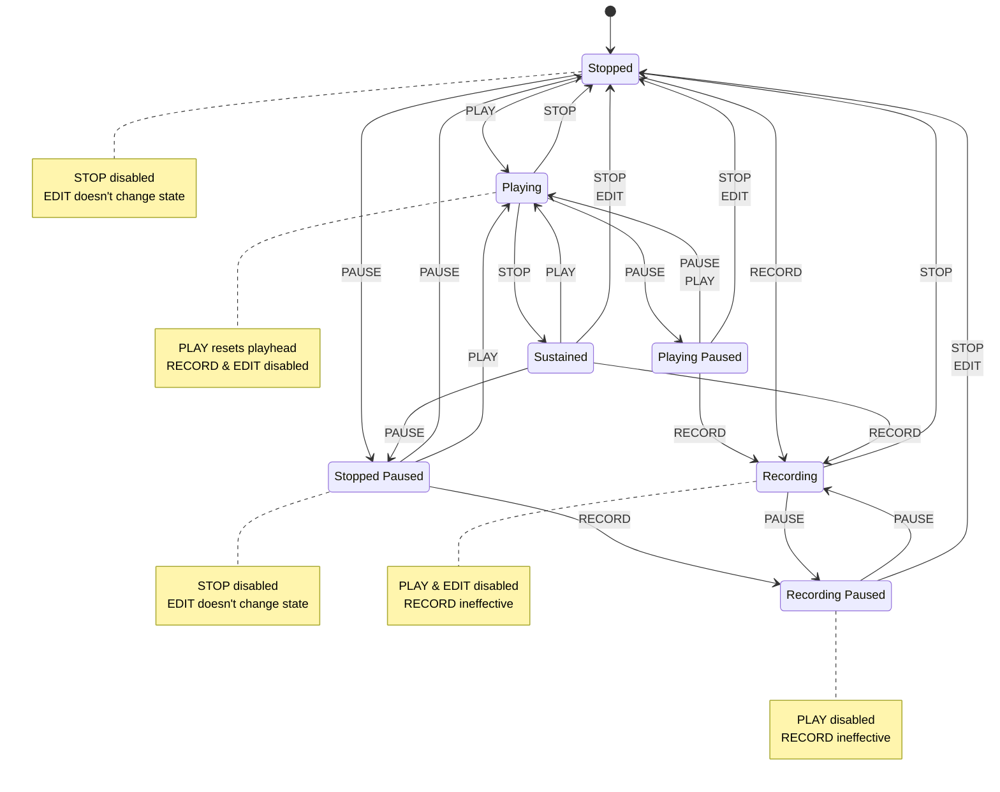

## Background

We are considering modifying the playback behavior to improve the user experience. In short, we would like to give a chance for effects with a tail (echo, reverb, etc.) to continue output audio after the playhead stops.

There are several playback-related states and actions users can take that bring from one state to another. This document presents the current and proposed state diagrams to help understand the changes.

There are five events

-  PAUSE
-  PLAY
-  STOP
-  RECORD
-  EDIT

The EDIT event broadly denotes all events that are currently prohibited during playback, such as edits of the track panel, applying effects, creating a new project, etc.

We would have the current six states, plus a new one, Sustained.

-  Stopped
-  Playing
-  Recording
-  Stopped Paused
-  Recording Paused
-  Playing Paused
-  Sustained (new)

In Sustained state, the playhead isn't moving, but the audio continues to play, giving a chance to effects with a tail to continue output audio.

Here's a state diagram of what the playback would be like:

The only difference to the current state diagram is that the Playing state now transitions to the Sustained state when the user stops the playback. Then, in Sustained state,
* PLAY brings back to the Playing state,
* STOP and EDIT bring to the Stopped state,
* RECORD brings to the Recording state,
* PAUSE is ineffective.
