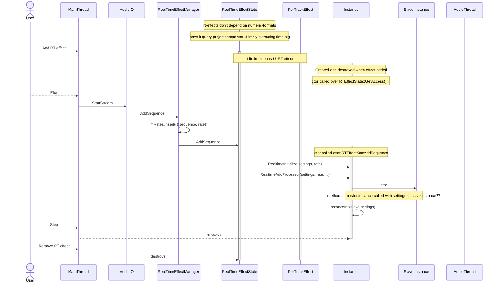

```mermaid
sequenceDiagram

actor User
participant MainThread
participant AudioIO
participant RTManager as RealTimeEffectManager
participant RTState as RealTimeEffectState
participant PerTrackEffect
participant Instance
participant SInstance as Slave Instance
participant AudioThread

Note over RTState:rt-effects don't depend on numeric-formats
Note over RTState:have it query project tempo would imply extracting time-sig

User -->> MainThread:Add RT effect
activate RTState
Note over RTState,PerTrackEffect:Lifetime spans UI RT effect
activate Instance
activate PerTrackEffect
Note over Instance:Created and destroyed when effect added
Note over Instance:ctor called over RTEffectState::GetAccess() ...
deactivate Instance

User -->> MainThread:Play
MainThread ->> AudioIO:StartStream
AudioIO ->> RTManager:AddSequence
RTManager ->> RTManager:mRates.insert({&sequence, rate})
RTManager ->> RTState:AddSequence
activate Instance
Note over Instance:ctor called over RTEffectXxx:AddSequence
RTState ->> Instance:RealtimeInitialize(settings, rate)
RTState ->> Instance:RealtimeAddProcessor(settings, rate, ...)
Instance ->> SInstance:ctor
Note over Instance,SInstance:method of master instance called with settings of slave instance??
Instance ->> Instance:InstanceInit(slave.settings)

User -->> MainThread:Stop
MainThread -->> Instance:destroys
deactivate Instance

User -->> MainThread:Remove RT effect
MainThread -->> RTState:destroys
deactivate RTState
deactivate PerTrackEffect
```
